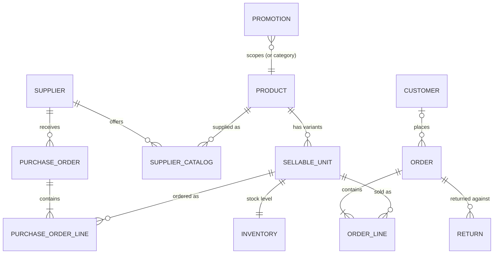

# Domain model

The flat CSV exports become nine entities plus two invented ones. The
authoritative DDL lives in `src/store_agent/db.py`; every session rebuilds an
in-memory SQLite database from `data/` so the store always starts in the
documented 2026-06-19 state (grading runs are reproducible by construction).

## Key modeling decisions

**Sellable unit vs product.** `products.csv` is really two concepts: the
*sellable unit* (SKU — what a cashier scans) and the *product* (`product_id` —
what suppliers price and promotions target). The `products` table keys on SKU
with `product_id` as a grouping attribute; variant axes (`color`, `size`) are
`NULL` for single-variant products. A six-variant tee and a one-variant tote
are then the same shape — no special cases (the data dictionary calls this
out explicitly).

**Walk-ins.** `orders.customer_id` is nullable; a walk-in is the absence of a
customer, not a sentinel "WALK-IN" row.

**Purchase orders are invented entities.** The seed has no PO export, but the
assignment's own prompts require creating POs (restock), listing open ones,
and receiving partial deliveries. `purchase_orders` (status `open`/`received`)
plus `purchase_order_lines` (`qty_ordered` vs `qty_received`, unit cost frozen
at creation time from the supplier catalog) support the whole lifecycle:
create → partial receive (stock in, PO stays open) → complete (auto-close).
PO lines reference SKUs, not products, so receiving knows exactly which
inventory row to bump.

**Promotions are pricing rules, not price changes.** A promotion never
mutates `retail_price`; the effective price is computed per (SKU, date) at
sale time — inclusive window, lowest-price-wins, no stacking (rule 5). The
price actually charged is then frozen into `order_lines.unit_price`, exactly
like the seeded Spring Tee Sale rows.

**Money.** Stored as REAL for query ergonomics (the read-only SQL tool), but
all rule arithmetic crosses into Python `Decimal` with half-up cent rounding
(rule 2) at the boundary, and leaves as canonical `"12.34"` strings. No float
math ever decides a price.

**ID sequences** continue the seed's conventions: next order `O-1016`, next
return `R-2002`, promotions `PR-002`, purchase orders start `PO-3001`.

## Table summary

| Table | Keys | Notes |
|---|---|---|
| `products` | `sku` PK | `product_id` groups variants; `color`/`size` NULL when no variants |
| `customers` | `customer_id` PK | |
| `suppliers` | `supplier_id` PK | |
| `supplier_catalog` | (`supplier_id`,`product_id`) PK | unit cost + lead time per supplier×product |
| `inventory` | `sku` PK | on-hand snapshot + reorder point/qty |
| `orders` | `order_id` PK | nullable `customer_id` = walk-in; whole-order discount % |
| `order_lines` | (`order_id`,`line_no`) PK | `unit_price` = charged that day, pre-order-discount |
| `returns` | `return_id` PK | condition `good` restocks, `damaged` doesn't |
| `promotions` | `promo_id` PK | percent-off, product or category scope, inclusive window |
| `purchase_orders`* | `po_id` PK | invented; `open`/`received` |
| `purchase_order_lines`* | (`po_id`,`line_no`) PK | invented; `qty_ordered` vs `qty_received` |

\* not present in the seed data — required by the restock/receiving workflows.
